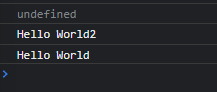
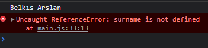
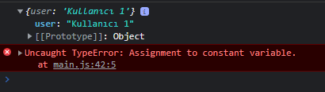
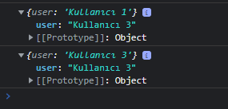
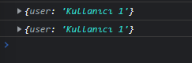
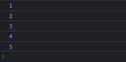

# Değişkenler
Değişken tanımlamak için **let** ve **const** komutlarını kullanıyoruz.
<br>
*Şimdi ilk tanımlamamızı yapalım.*
```javascript
   let userName = "belkisarslan"
   console.log(userName);
```
<br>
Önce değişkene veri atanır, ardından console.log a yazdırılır. Peki tam tersini yapmış olsaydık, ne olurdu?
<br>

*Deneyelim*

```javascript
   console.log(fullName);
   let fullName = "Belkıs Arslan"
```
Şu şekilde bir hata alırdık.

```
Uncaught ReferenceError: Cannot access 'fullName' before initialization
```
**let** ile yaptığımız tanımlamaları değiştirebilir ya da o tanımlamalara eklemeler yapabiliriz.

*Hadi deneyelim.*

```javascript
   let inform = "Güncelleme yapılamadı."
   inform = "Güncellendi"
   inform += " ve yayınlandı."
   console.log(inform);
```
Yazdığımız kod parçacığının çıktısı şu şekilde olacaktır:
```
Güncellendi ve yayınlandı.
```
**const** ile yaptığımız tanımlamalar ise değiştirilemez.

*Şimdi bir şifre tanımlaması yapalım ve onu değiştirmeye çalışalım.*

```javascript
   const password = "asdasdas"
   console.log(password);
   password = "xdxdxdxd"
   console.log(password);
```
Şu şekilde bir hata alırız.

```
Uncaught TypeError: Assignment to constant variable.
```
## Özetlersek
--------------
1. **let** tanımlamaları değiştirilebilir.
2. **const** tanımlamaları değiştirilemez.

## Tanımlama Kuralları
----------------------
1. Büyük harf küçük harf duyarlılığı vardır.
2. Değişken isimleri arasında boşluk bırakılmaz.
3. Komut isimleriyle tanımlama yapılamaz.
4. Değişken isimleri sayı ile başlayamaz.

Sonraki derste görüşmek üzere...

Bugün var, let ve const tanımlamalarıyla ilgili müthiş bir ders izledim ve buraya da eklemek istedim.

*Öncelikle var tanımlamasıyla başlayalım.*

```javascript
   var msg = "Hello World"
   function test(){
     var msg = "Hello World2"
     console.log(msg) // çıktı: Hello World2
   }
   test()
   console.log(msg) // çıktı: Hello World
```
*Peki Hello World2'yi tanımlamadan önce sorgulasaydık ne olurdu?*
Yani şöyle olsaydı;

```javascript
   var msg = "Hello World"
   function test(){
      console.log(msg)
      var msg = "Hello World2"
      console.log(msg)
   }
   test()
   console.log(msg)
```


Bu şekilde bir sonuç alırdık. Peki neden undefined oldu? Nedenini bugün öğrendim ve çok heyecanlandım :) 

Burada hoisting kavramı devreye giriyor. Var ile tanımlanmış değişkenler yukarı çekiliyor. Değişken yukarıda tanımlanıyor ancak içi boş oluyor. Değer atandıktan sonra console ekranında görebiliyoruz. Yani;

```javascript
    var msg = "Hello World"
   function test(){
      var msg // bu şekilde tanımlanmış oluyor
      console.log(msg)
      var msg = "Hello World2" // değer burada atanıyor
      console.log(msg)
   }
   test()
   console.log(msg)
```

*let tanımlamasıyla devam edelim.*

```javascript
   let fullName = "Belkıs Arslan"
   console.log(fullName)
   {
    let surname = "Arslan"
   }
   console.log(surname)
```
İlk let tanımlamasını global olarak ikinci let tanımlamasını ise blok içinde yaptık. Peki sonuç ne olacak dersiniz?

*Evet, tam da tahmin ettiğiniz gibi,*



Blok içinde tanımladığımız let değişkenine dışardan ulaşamadık.

*Şimdi de const tanımlamasından bahsedelim.*

```javascript
   const app = {
    user:"Kullanıcı 1"
   }
   console.log(app)

   app = {
    user:"Kullanıcı 2"
   }
   console.log(app)
```
Const ile tanımlananları değiştiremeyeceğimizden daha önce bahsetmiştik. Tahmin edeceğiniz üzere ikinci adımda hata aldık.



Ancak const içindeki array ve object değiştirilebilir. Yani;

```javascript
   const app = {
    user:"Kullanıcı 1"
   }
   console.log(app)
   app.user = "Kullanıcı 3"
   console.log(app)
```
Yukarıdaki gibi bir değişiklik yapmış olsaydık hata almayacaktık.



*Peki ya içeriğimizin asla değişmesini istemezsek?*

Öyle bir durumda ise Object.freeze yöntemini kullanabiliriz.

```javascript
   const app = {
    user:"Kullanıcı 1"
   }
   console.log(app)
   Object.freeze(app) // Bu işlemin ardından
   app.user = "Kullanıcı 3"
   console.log(app)
```
Önceden tanımladığımız Kullanıcı 3 bu işlemin ardından tekrar Kullanıcı 1 olacaktır.



*Peki şimdi küçük bir pekiştirme yapalım.*

```javascript
   for (const i = 1; i <= 5; i++){
    console.log(i)
   }
```
Bu işlemde şu hatayı aldık.

```
Uncaught TypeError: Assignment to constant variable.
```
Peki neden böyle bir hata aldık? Yaptığımız for döngüsü bir artış işlemi ifade etmektedir ancak biz değiştirilemez olan const ile tanımlama yaptık.

let ile tanımlama yapıp hatamızı düzeltelim.

```javascript
   for (let i = 1; i <= 5; i++){
    console.log(i)
   }
```


<hr>

**Kaynaklar**
1. Kodluyoruz:
https://www.youtube.com/c/Kodluyoruz
2. PROTOTURK:
https://www.youtube.com/c/PROTOTURKCOM

Ne kadar teşekkür etsem az :)


