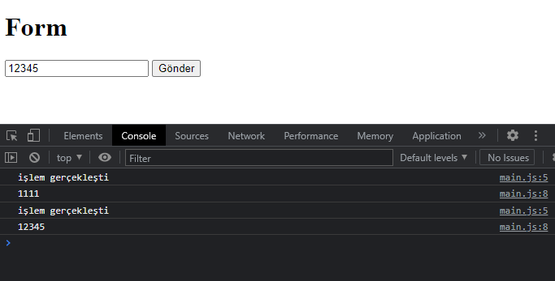
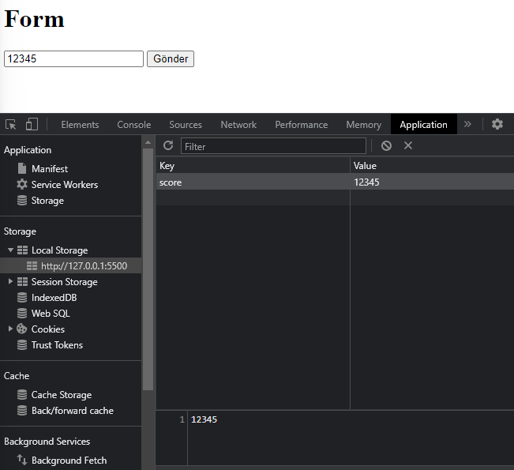
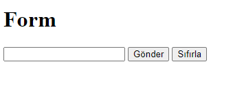

# Form

HTML'de düzenlediğimiz formu JavaScript ile dinamikleştirelim.

*Öncelikle formumuzu seçelim.*

```javascript
   let formDOM = document.querySelector("#userForm")
```

*Submit olduğunda çalışacak olan fonksiyonumuzu ekleyelim.*

```javascript
   formDOM.addEventListener('submit', formSubmit)
   function formSubmit(){
       console.log("işlem gerçekleşti")
   }
```
Bu şekildeyken kontrol ettiğimizde görüyoruz ki işlem gerçekleşiyor ancak her defasında sayfamız refresh oluyor. Yani her işlem sonunda sayfa kendini yenilediği için console ekranında işlemimizi çok hızlı bir geçiş olarak görebiliyoruz. Peki bunu nasıl önleyeceğiz?

```javascript
   function formSubmit(event){
    console.log("işlem gerçekleşti")
    event.preventDefault()
   }
```
preventDefault() metodu ile bu sorunun önüne geçebiliriz.

*Şimdi input'a yazdığımız değerleri console ekranında görmeye çalışalım.

```javascript
   function formSubmit(event){
    console.log("işlem gerçekleşti")
    event.preventDefault()
    let scoreInputDom = document.querySelector("#score")
    console.log(scoreInputDom.value)
}
```



*İçeriğimizi local storage olarak kaydedelim.*

```javascript
   function formSubmit(event){
    console.log("işlem gerçekleşti")
    event.preventDefault()
    let scoreInputDom = document.querySelector("#score")
    console.log(scoreInputDom.value)
    localStorage.setItem('score',scoreInputDom.value)
}
```


Peki input'a içeriği girdikten sonra her defasında o alanı temizleyip başka bir bilgi girmeye uğraşmasak ve her submit olayından sonra veri girilen alan kendiliğinden temizlense, güzel olmaz mı?

Bunun için bir html, bir de js yönteminden bahsedeceğim. İlk olarak html'e type'ı reset olan bir buton ekleyebiliriz.

```html
   <button type="reset">Sıfırla</button>
```



Sıfırla butonuna bastığımız anda temizlenecek.
Butona basmakla uğraşmayalım kendiliğinden gitsin derseniz, js yöntemi tam size göre :)

```javascript
   scoreInputDom.value = ""
```
Fonksiyona ekleyeceğimiz bu kod, input alanını submit olayından hemen sonra kendiliğinden temizleyecektir.

