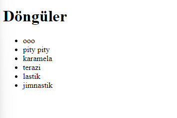

# Döngüler

## For Döngüsü

for döngüsü için parantez içinde noktalı virgüllerle ayrılan üç kısım oluşturulur. İlk kısma, değişken tanımlama, ikinci kısma koşul, son kısma ise artış miktarı yazılır.

*Hemen bir örnek verelim.*

```javascript
   for(let index = 0; index < 10; index++){
    console.log(index)
   }
```
Çıktı:


*Şimdi bir array döndürelim.*

```javascript
   let users = ["kullanıcı1", "kullanıcı2", "kullanıcı3",]
   for(let index = 0; index < (user.length); index++){
  console.log(users[index])
}
```
Çıktı:


*Console ekranında gördüğümüz bilgiyi HTML ekranına yazdırmaya çalışalım.*

```javascript
   let users = ["kullanıcı1", "kullanıcı2", "kullanıcı3",]
   const userListDOM = document.querySelector('#userList')
   for(let index = 0; index < (users.length); index++){
   const liDOM = document.createElement('li')
   liDOM.innerHTML = users[index]
   userListDOM.appendChild(liDOM)
}
```
Çıktı:


### Break

Break döngüyü kendisine kadar döndürür. Yani döngü break yazdığımız yere kadar devam eder.

*Bir örnekle pekiştirelim.*

```javascript
   let users = ["ooo", "pity pity", "karamela", "sepeti", "terazi", "lastik", "jimnastik"]
   const userListDOM = document.querySelector('#userList')
   for(let index = 0; index < (users.length); index++){
   if(users[index] == "sepeti") {break}
   const liDOM = document.createElement('li')
   liDOM.innerHTML = users[index]
   userListDOM.appendChild(liDOM)
}
```
Kod açıklaması: "sepeti" ye kadar döndür ve "sepeti"de döngüyü durdur.

Çıktı:


### Continue

Continue ise döngüden çıkar demek. Belirttiğimiz ifade atlanır ve döngü kaldığı yerden devam eder.

```javascript
   let users = ["ooo", "pity pity", "karamela", "sepeti", "terazi", "lastik", "jimnastik"]
   const userListDOM = document.querySelector('#userList')
   for(let index = 0; index < (users.length); index++){
   if(users[index] == "sepeti") {continue}
   const liDOM = document.createElement('li')
   liDOM.innerHTML = users[index]
   userListDOM.appendChild(liDOM)
}
```

Çıktı:



## While Döngüsü

Şarta bağlı işlemlerin yapılması için while kullanılır. Şart sağlanmayana kadar döngü devam eder. Sonsuz döngüye girme durumları da yaşanabilir. Yani bu ne demek?

```javascript
   let num = 10
   while (num == 10){
    console.log(num)
   }
```
Bu ifade sonsuz bir döngüye girer. Koşuldaki sayı tanımladığımız sayıya eşit olduğu sürece döngü devam eder. Koşuldaki sayının değişmesi sağlanırsa döngü sonsuz döngüden çıkar.

*1'den 10'a kadar olan sayıları yazdırmaya çalışalım.*

```javascript
   let num=1;
   while(num<=10){
   console.log(num);
   num++; 
}
```
Bu şekilde 1'den 10'a kadar sayılar yazdırılır.

*1'den 10'a kadar sayıları yazdıralım.*

```javascript
   let num = 1,
   total = 0;
   while(num <= 10){
   total += num;
   num++;
   }
   console.log(total); // sonuç: 55
```

## forEach

forEach bir array döngüsüdür.

```javascript
   let numbers = [1, 2, 3, 4, 5, 6, 7, 8, 9, 10]
   numbers.forEach((item, index, array) => 
   console.log(item, index, array))
```

Sonuç:


Böylece sırasıyla sayılarımızı, index numaralarını ve array hallerini yazdırabildik.

Şimdi 1'den 10'a kadar sayıları bir de forEach yöntemiyle toplayalım.

```javascript
   let numbers = [1, 2, 3, 4, 5, 6, 7, 8, 9, 10]
   let total = 0
   numbers.forEach(function(number){
   total += number
   })
   console.log(total) // sonuç: 55
```

Şu şekilde de yazabiliriz.

```javascript
   let numbers = [1, 2, 3, 4, 5, 6, 7, 8, 9, 10]
   let total = 0
   function totalNumber(number){
     total += number
   }
   numbers.forEach(totalNumber)
   console.log(total) // sonuç: 55
```

Yukarıda for ile döndürdüğümüz kullanıcı1, kullanıcı2, kullanıcı3 örneğini bir de forEach ile döndürelim.

```javascript
   let users = ["kullanıcı1", "kullanıcı2", "kullanıcı3",]
   const userListDOM = document.querySelector('#userList')
   users.forEach(item =>{
   const liDOM = document.createElement('li')
   liDOM.innerHTML = item
   userListDOM.appendChild(liDOM)
})
```
Çıktı:


