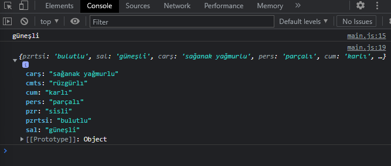
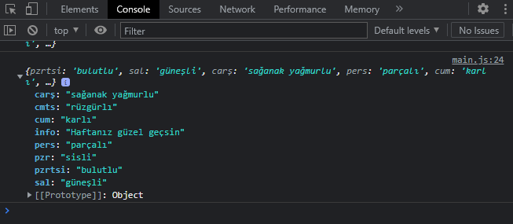

# Object

```javascript
   let item1 = {}
   let item2 = new Object()
```
Bu iki kullanım da nesnedir. JavaScript nesne tabanlı bir dil olduğu için nesneleri iyi kavramalıyız.

```javascript
   let day = {
    pzrtsi : "bulutlu",
    sal : "güneşli",
    carş : "yağmurlu",
    pers : "parçalı",
    cum : "karlı",
    cmts : "rüzgürlı",
    pzr : "sisli"
}
```
Salı gününün hava durumuna ulaşmaya çalışalım.

```javascript
   console.log(day.sal) // güneşli
```

Çarşamba gününün hava durumunu sağanak yağmurlu olarak güncelleyelim
```javascript
   day.carş = "sağanak yağmurlu"
   console.log(day)
```



Hava durumuna iyi bir temenni ekleyelim

```javascript
   day.info = "Haftanız güzel geçsin"
   console.log(day)
```



