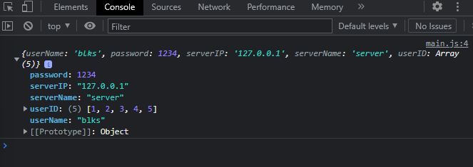
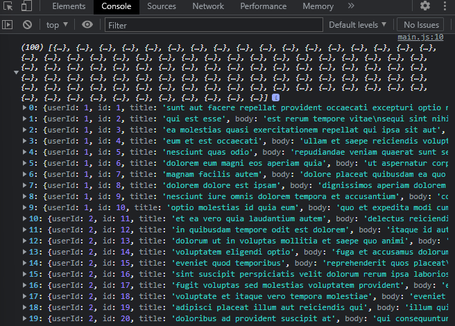
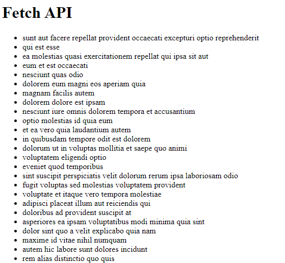

# Fetch API

Fetch API web tarayıcılarından sunuculara veri almak veri göndermek gibi isteklerde bulunmak için özelikler sunmaktadır.

*Öncelikle bir json dosyası oluşturup verilerimizi oraya kaydedelim.*

```json
  {
  "userName" : "blks",
  "password" : 1234,
  "serverIP" : "127.0.0.1",
  "serverName" : "server",
  "userID" : [1, 2, 3, 4, 5]
  }
```
*Şimdi json dosyasından verilerimizi çekmeye çalışalım.*

```javascript
   fetch("settings.json").then(response =>{
   return response.json()
   }).then(responseJson => {
    console.log(responseJson)
   })
```

Çıktı:



*Şimdi jsonplaceholder sitesinden veri çekelim.*

```javascript
   fetch('https://jsonplaceholder.typicode.com/posts')
  .then(response => response.json())
  .then(json => console.log(json))
```
Çıktı:



*Şimdi bu aldığımız verileri listeye ekleyelim.*

```javascript
   let userListDOM = document.querySelector('#userList')
   fetch('https://jsonplaceholder.typicode.com/posts').then(
    response => response.json()
   ).then(json => {
    json.forEach(item => {
       let liDOM = document.createElement('li')
       liDOM.innerHTML = item.title
       userListDOM.appendChild(liDOM)
     });
    })
```
Çıktı:




*Fake API'dan gelen bütün verileri HTML sayfamıza aktardık :)*


