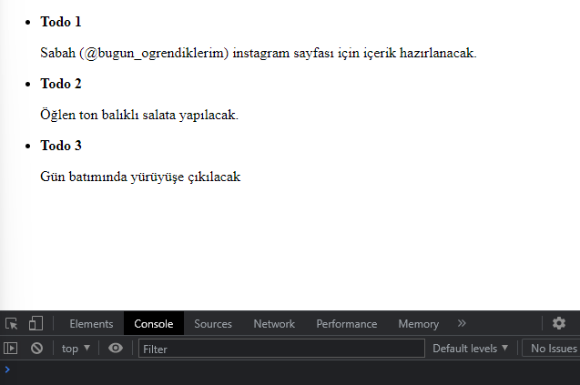
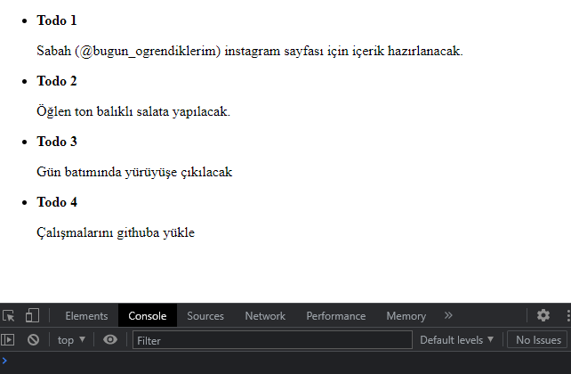
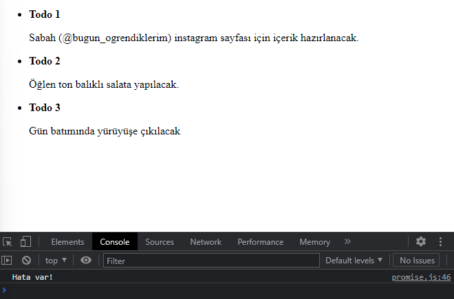
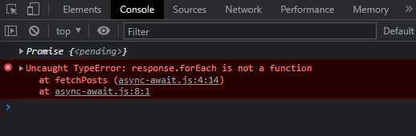
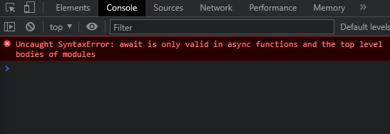
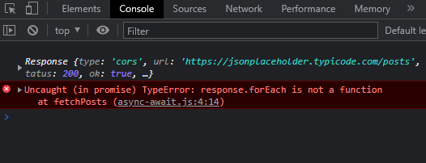
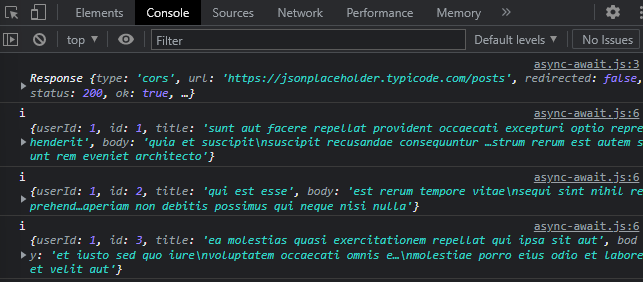

# Callback

Bu konuyu iyice anlamak istiyorum. Adım adım ayrıntılı yazacağım.

*Önce bir todo list hazırlayalım.*

```javascript
   const todos = [
    {title: "Todo 1", description: "Sabah (@bugun_ogrendiklerim) instagram sayfası için içerik hazırlanacak."},
    {title: "Todo 2", description: "Öğlen ton balıklı salata yapılacak."},
    {title: "Todo 3", description: "Gün batımında yürüyüşe çıkılacak"}
]
```

*Listemizi seçelim.*

```javascript
   let todoListElement = document.querySelector("#todoList")
```

setTimeout metodu ve forEach döngüsü ile listemizi oluşturalım.

```javascript
   function todoList(){
        setTimeout(() => {
      let todoItems = ""
      todos.forEach(item => {
         todoItems += `
         <li>
            <b>${item.title}</b>
            <p>${item.description}</p>
         </li>
         `
      })
      todoListElement.innerHTML = todoItems;
   }, 1000);
   }
   todoList()
```

Listemiz sorunsuz bir şekilde geliyor.



*Şimdi listeye yeni bir madde eklemeye çalışalım.*

```javascript
function newTodo(todo){
  setTimeout(() => {
    todos.push(todo)
  }, 2000);
}

newTodo({
  title : "Todo 4",
  description : "Çalışmalarını githuba yükle"
})
```

Listeye yine bir eleman ekledik ancak kodu çalıştırdığımızda, yeni maddenin ekrana gelmediğini gördük. Asenkron bir yapı olduğu için işlemlerin birbirini bekleme durumu olmuyor. İşte tam bu aşamada, bir fonksiyonun işlemini tamamladıktan sonra, başka bir fonksiyonun çalışmasını sağlayan callback fonksiyonu devreye giriyor.

todo parametresinin yanına ve pushlama işleminin hemen sonrasına callback fonksiyonunu ekliyoruz.

```javascript
function newTodo(todo, callback){
  setTimeout(() => {
    todos.push(todo)
    callback()// callback fonksiyonunu çağırıyoruz
  }, 2000);
}

newTodo({
  title : "Todo 4",
  description : "Çalışmalarını githuba yükle"
},todoList)//parantez açmıyoruz
```

**Buradaki önemli ayrıntı :**
Yeni maddemizi listelemek için newTodo'nun sonuna eklediğimiz todoList fonksiyonuna parantez açmıyoruz. Çünkü açarsak todoList fonksiyonu çalışır ama biz yukardaki callback fonksiyonunun çalışmasını istiyoruz.


Sonuç:




<br>

# Promise

Yalnızca bir tane asenkron işlemimiz varsa, callback fonksiyonunu kullanmak sorun değildir. Ancak, birden fazla asenkron işlemi belirli sırayla tamamlamamız gerekiyorsa callback yönetilemez. Callback fonksiyonunun sıkıntılı yönleriyle karşılaşılmaması için promise yapısı kullanılır.

*Önceki örnekte kurduğumuz kod yapısının aynısı kuralım.*

```javascript
function newTodo(todo){
  return new Promise((resolve, reject)=> {
    setTimeout(() => {
        todos.push(todo)
      }, 2000);
  })
}
```
newTodo fonksiyonuna new Promise yapısı ekliyoruz.
resolve, her şey başarılı olduğunda promise yapısından dönecek sonucu verir, reject ise herhangi bir hata olduğunda dönecek cevabı verir. Bu duruma if/else bloklarımızı oluşturalım.

```javascript
function newTodo(todo){
  return new Promise((resolve, reject)=> {
    setTimeout(() => {
        todos.push(todo)
        const e = false;

        if(!e){
          resolve()
        }else{
          reject("Hata var!")
        }
      }, 2000);
  })
}
```

Her şey yolundaysa ve resolve döndüyse .then( ) ile devam ediyoruz. Nasıl mı?

```javascript
newTodo({
   title : "Todo 4",
   description : "Çalışmalarını githuba yükle"
}).then(response => {
   todoList()
})
```
Peki hata varsa, yani reject dönerse? Hatalı döndürmesi durumu için de catch( ) ile devam ediyoruz.

```javascript
newTodo({
   title : "Todo 4",
   description : "Çalışmalarını githuba yükle"
}).then(response => {
   todoList()
}).catch(e => {
   console.log(e)
})
```


Son eklediğimiz Todo 4 görüntülenmedi ve hata var uyarısı aldık.

**Not :** reject döndürebilmek için promise içinde tanımladığımız error'a true değeri verdik.


<br>


# Async/Await

Async await ile fonksiyon bitene kadar bekle komutu verebiliriz.
Jsonplaceholder sayfasından çektiğimiz fake verileri forEach döngüsüne aktarmış olsaydık ,

```javascript
function fetchPosts(){
   const response = fetch('https://jsonplaceholder.typicode.com/posts')
   console.log(response)
   response.forEach(i => {
      console.log('i', i)
   });
}
fetchPosts()
```

şu şekilde bir hata alırdık.



response bize promise döndürmesi sebebiyle hata almamak için verilerin beklemesini sağlamalıyız. Bunu da beklemesini istediğimiz yapının önüne await koyarak yapabiliriz.

```javascript
function fetchPosts(){
   const response = await fetch('https://jsonplaceholder.typicode.com/posts')
   console.log(response)
   response.forEach(i => {
      console.log('i', i)
   });
}
fetchPosts()
```
Peki await'i ekledik ancak bir hata daha aldık.



await'in yalnızca asenkron işlemlerde geçerli olduğunu söylüyor. Fonksiyonun başına async ekleyerek hatamızı düzeltelim.

```javascript
async function fetchPosts(){
   const response = await fetch('https://jsonplaceholder.typicode.com/posts')
   console.log(response)
   response.forEach(i => {
      console.log('i', i)
   });
}
fetchPosts()
```

Bir hata daha aldık :)



Çünkü verilerimizi array'e döndürmedik. Gelen response'u .json ile array'e döndürelim.

```javascript
async function fetchPosts(){
   const response = await fetch('https://jsonplaceholder.typicode.com/posts')
   console.log(response)
   //bunu da await ile bekletiyoruz çünkü bu da zaman alabilir
   const data = await response.json()
   //response yerine data'yı gönderiyoruz
   data.forEach(i => {
      console.log('i', i)
   });
}
fetchPosts()
```

Ve sonuç :



Verilerimiz çiçek gibi geldi :)

<hr>

**Kaynak**
*kablosuzkedi* : https://www.youtube.com/watch?v=ayvrylRT14M&t=209s

Ne kadar teşekkür etsem az :)


