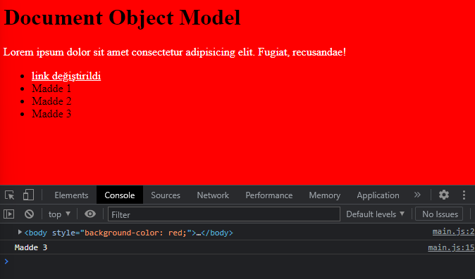
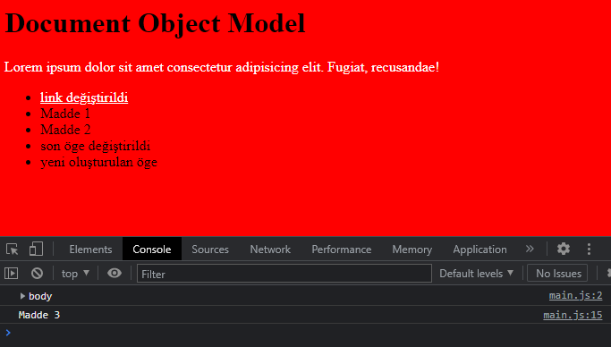

# Document Object Model
DOM ile HTML dokümanları içerisindeki nesnelere kolaylıkla ulaşıp değişiklikler yapabiliriz.

*Mesela body'e ulaşalım ve rengini değiştirelim.*

```javascript
   console.log(document.body)
   document.body.style.backgroundColor = "red";
```


<hr>


*Body içindeki id tanımlaması yapılmış paragrafa ulaşıp rengini beyaz yapalım.*

```javascript
   let p = document.getElementById("p")
   p.style.color = "white"
```


<hr>


*Liste içindeki a etiketine ulaşarak yazısını değiştirelim.*

```javascript
   let link = document.querySelector("ul>li>a")
   link.innerHTML = "link değiştirildi"
```

<hr>


*Liste içindeki son elemana ulaşmaya çalışalım.*

```javascript
   let item = document.querySelector("li:last-child");
   console.log(item.innerHTML)
```



```javascript
   item.innerHTML = "son öge değiştirildi"
```

Şu şekilde yazdığımızda ise ulaştığımız elemanın içeriğini değiştirebiliriz.
<hr>


*Listeye yeni bir eleman ekleyelim.*

```javascript
   let newItem = document.querySelector("ul")
   let newLi = document.createElement('li')
   newLi.innerHTML = "yeni oluşturulan öge"
   newItem.append(newLi)
```


