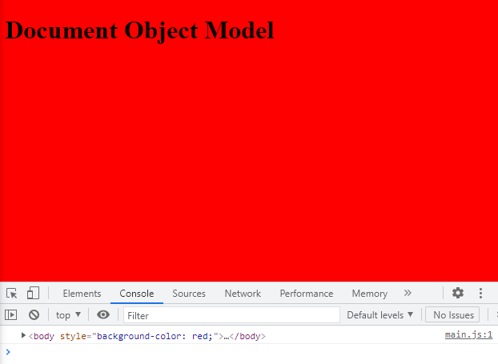
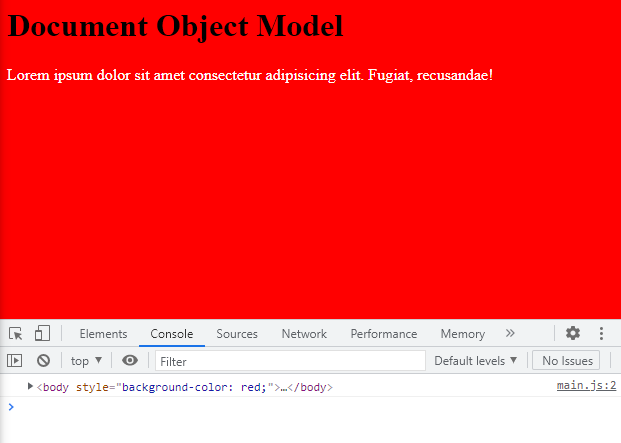
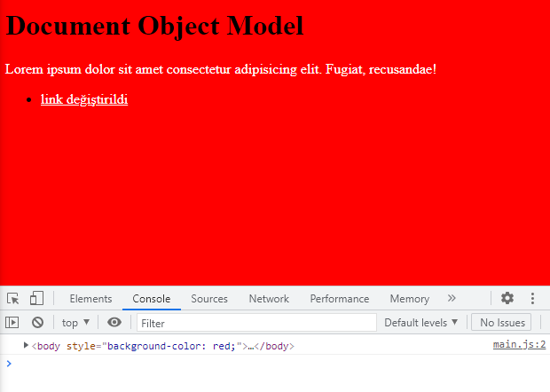

# Document Object Model
DOM ile HTML dokümanları içerisindeki nesnelere kolaylıkla ulaşıp değişiklikler yapabiliriz.

*Mesela body'e ulaşalım ve rengini değiştirelim.*

```javascript
   console.log(document.body)
   document.body.style.backgroundColor = "red";
```


<hr>

*Body içindeki id tanımlaması yapılmış paragrafa ulaşıp rengini beyaz yapalım.*

```javascript
   let p = document.getElementById("p")
   p.style.color = "white"
```


<hr>

*Liste içindeki a etiketine ulaşarak yazısını değiştirelim.*

```javascript
   let link = document.querySelector("ul>li>a")
   link.innerHTML = "link değiştirildi"
```

<hr>

