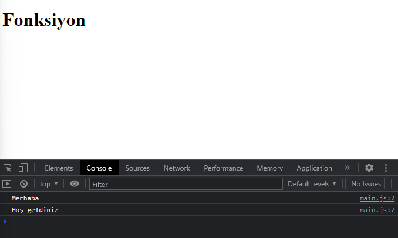
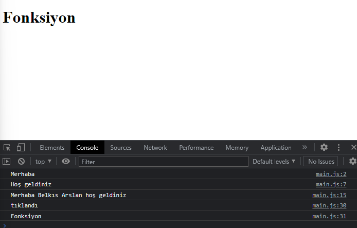
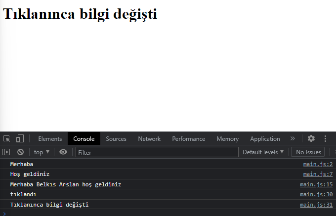

# Fonksiyon

Fonksiyon belirli bir işlemi yapmak için tasarlanmış kod bloğudur.

*İlk fonksiyonumuzu oluşturalım.*

```javascript
   function hello(){
    console.log("Merhaba")
}
```
**Önemli not:**
Bu şekilde bırakırsak hiçbir şey göremeyiz.
Peki ne yapmalıyız?

```javascript
   hello()
```
Tanımladığımız fonksiyonu yukarıdaki gibi çağırmalıyız.
Yani kod bloğumuz şu şekilde olmalıdır.

```javascript
   function hello(){
   console.log("Merhaba")
   }
   hello()
```
İç içe fonksiyon tanımlaması da yapabiliriz. Mesela bir işlem gerçekleştikten sonra başka bir işlem gerçekleşsin istiyoruz, ne yapacağız?

*Hemen deneyelim.*

```javascript
   function hello(){
    console.log("Merhaba")
    welcome()
   }

   function welcome(){
    console.log('Hoş geldiniz')
   }

   hello()
```
Bu işlemle hello fonksiyonu çalıştıktan hemen sonra welcome fonksiyonu devreye girecektir.



Çok güzel, değil mi? :)

*Şimdi başka bir örnek yapalım.*

```javascript
   const hello2 = (name) => `Merhaba ${name} hoş geldiniz`
   console.log(hello2("Belkıs Arslan"))
```
=> Bu işaretle kurulan fonksiyonlara arrow function denilmektedir. Backtick arasında kullandığımız template literals konusu ise daha önce öğrenmiştik :)

Çıktı şu şekilde görünecek:

```
Merhaba Belkıs Arslan hoş geldiniz
```

*Click Event'i öğrenelim.*

```javascript
   let title = document.querySelector(".title")
   title.addEventListener("click", function(){
   console.log("tıklandı")
}) 
```
Başlığa tıkladığımızda tıklandı bilgisini elde ederiz.

Peki tıkladığımız elemente ulaşabilir miyiz?

*Şimdi onu öğrenelim.*

```javascript
   let title = document.querySelector(".title")
   title.addEventListener("click",domClick)

   function domClick(){
   console.log('tıklandı')
   console.log(this.innerHTML)
   }
```



Peki tıkladığımız elementin içeriğini değiştirebilir miyiz? 

*Deneyelim.*

```javascript
   console.log(this.innerHTML = "Tıklanınca bilgi değişti")
```
Bu işlemden sonra içeriğimiz değişecektir.




Rengini değiştirmek isteseydik: 
```javascript
   console.log(this.style.color = "red")
```

Peki bir tıklamada siyah, bir tıklamada kırmızı olmasını istersek ne yapacağız?
*Hemen görelim.*

```javascript
   this.style.color == "red" ? this.style.color ="black" : this.style.color ="red"
```
Bu kod bloğundan sonra isteğimiz gibi olacaktır :)


