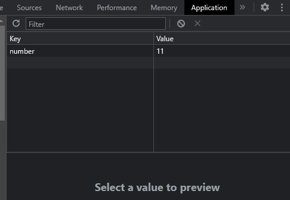
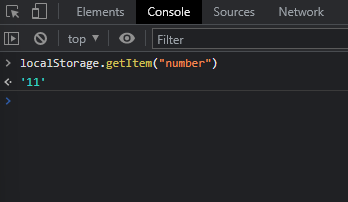
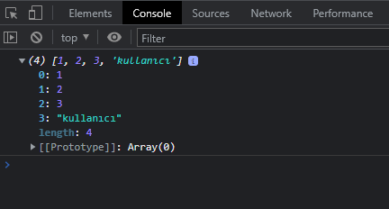
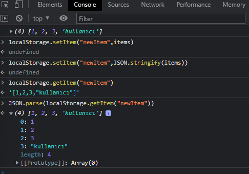

# Local Storage

Local Storage, verilerde yapılan değişikliklerin kaydının tutulmasıdır.

*Küçük bir örnekle görelim.*

```javascript
   localStorage.setItem("number",11)
```

Veriler key ve value olarak kaydedilir.



*Peki kaydettiğimiz veriyi çağırmak istersek?*

```javascript
   localStorage.getItem("number")
```


<hr>

*Şimdi bir liste örneği yapalım.*

```javascript
   let user = "kullanıcı"
   let items = [1,2,3,user]
   console.log(items)
```


Verilerimizi console üzerinde bu şekilde görebiliyoruz.

*Şimdi local storage olarak kaydedelim.*




